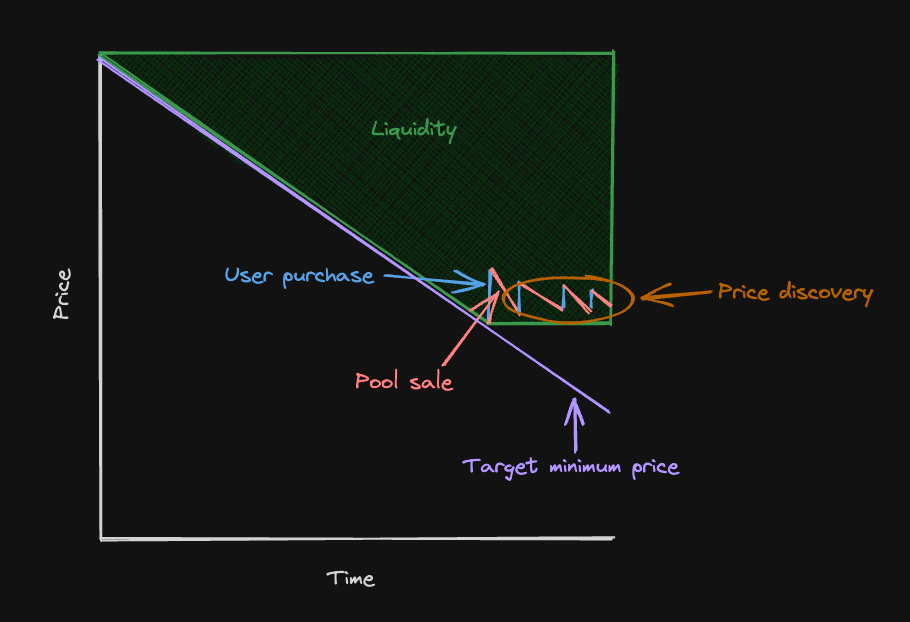

# Uni-LBP

A capital-efficient Uniswap v4 liquidity bootstrapping pool (LBP) hooks contract.

## Overview

Uni-LBP is a Uniswap v4 pool that allows tokens to be sold at a linearly decreasing price. By leveraging v4 hooks, it emulates the functionality of Balancer's LBP. The pool smoothly increases liquidity and sell pressure based on a set schedule, ensuring accurate price discovery, equality for all purchasers, and reduced bot effectiveness.

### Benefits

In addition to typical LBP advantages, Uni-LBP offers:

- **No initial capital requirements**: Only the bootstrapping token is needed.
- **Capital efficiency**: Thanks to Uniswap v4's concentrated liquidity.
- **Limit orders**: Enables traders to place effective limit orders by adding single-sided liquidity.
- **Gas efficiency**: Optimized for lower transaction costs.

## Mechanism



Before allowing a swap in any epoch, the pool adjusts its liquidity position based on the elapsed bootstrapping time. Over time, liquidity is progressively added. The quantity and minimum range of this liquidity decreases linearly:

- Price range equation: `(maxTick - targetMinTick) / (maxTick - minTick) = timeElapsed / timeTotal`
- Target liquidity equation: `(targetLiquidity / totalAmount) = timeElapsed / timeTotal`

If the price is within our liquidity range, additional liquidity, matching the target amount, will be sold into the pool. This drives the price downwards until it exits the range, after which liquidity provision continues. This ensures efficient price discovery and liquidity provisioning at the best prices.

The contract is easily adaptable to variances in price decay mechanisms such that the provided liquidity is optimal for the intended purpose.

## Usage

> **NOTE:** The address used to call `PoolManager.initialize` will be set as the pool `owner`, **allowing only that address to withdraw liquidity** at the end of the bootstrapping period. The address used as pool `owner` **must be able to receive both currencies used in the pool**. You may transfer ownership after initialization with `transferPoolOwnership`.

To integrate this hook with a pool:
- Approve the hook address to spend at least `liquidityInfo.totalAmount` of the bootstrapping token
- Initialize a pool with Uniswap v4's `PoolManager.initialize`, passing in the deployed hook contract address as `PoolKey.hooks` and the `LiquidityInfo` and `epochSize` you intend to use. e.g.:

```solidity
PoolKey key = PoolKey(
    Currency.wrap(address(token0)), // Pool token0 (lower numerically ordered token address in the pool)
    Currency.wrap(address(token1)), // Pool token1 (higher numerically ordered token address in the pool)
    0, // Fee to be used by the pool
    MIN_TICK_SPACING, // Tick spacing to be used by the pool
    liquidityBootstrappingHooks // This hook contract
);

LiquidityInfo memory liquidityInfo = LiquidityInfo({
    totalAmount: uint128(1000e18), // Total amount of tokens to bootstrap
    startTime: uint32(10000), // Start time of bootstrapping period
    endTime: uint32(10000 + 86400), // End time of bootstrapping period
    minTick: int24(0), // Minimum tick to provide liquidity at (NOTE: If token1 is bootstrapping token, value is inverted and used as upper tick)
    maxTick: int24(5000), // Minimum tick to provide liquidity at (NOTE: If token1 is bootstrapping token, value is inverted and used as lower tick)
    isToken0: true // Whether the bootstrapping token is token0
});

// The intended duration of each epoch
uint256 epochSize = 1 hours;

// Initialize
poolManager.initialize(key, SQRT_RATIO_2_1, abi.encode(liquidityInfo, epochSize));
```

## Todo

- [x] [Native currency support](https://github.com/kadenzipfel/uni-lbp/issues/4) (good first issue)
- [ ] [Decaying upper bound of liquidity range](https://github.com/kadenzipfel/uni-lbp/issues/5)
- [ ] Different price decay functions

## License

This project is licensed under the MIT License.

## Disclaimer

This is experimental software and is provided on an "as is" and "as available" basis. We do not give any warranties and will not be liable for any loss incurred through any use of this codebase.
